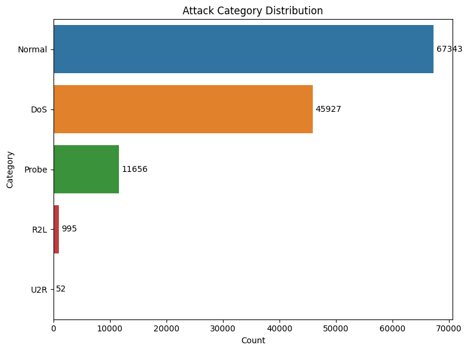

# NSL-KDD Cybersecurity Analysis Report

## About the Dataset

We used the **NSL-KDD dataset**, a well-known dataset in cybersecurity used to evaluate intrusion detection systems. Each row in the dataset represents a network session with various features like duration, bytes transferred, protocol used, and more.

Every session is labeled with an **attack type** (e.g., 'neptune', 'smurf') or 'normal'. We grouped all these attack types into **five categories** for clarity:

- **Normal** – Regular, legitimate sessions
- **DoS** – Denial of Service attacks
- **Probe** – Scanning attacks (e.g., port scanning)
- **R2L** – Remote-to-Local attacks
- **U2R** – User-to-Root attacks

---

## Step 1–4: Data Exploration and Cleaning

We examined the dataset, removed irrelevant features, and normalized the numeric values to bring them to the same scale.

We then reduced the number of features (columns) using a technique called PCA. This helped us keep only the most important information, making the analysis faster and clearer.

- **Correlation:**
- Correlation is a single number between –1 and +1 that tells you how strongly and in what direction two numeric values tend to increase or decrease together.

- **Association:**
- the goal here is to understand how categories like `service` or `attack type` influence numerical metrics such as `session length` or `data volume`.  

- to understand the reuslts, here are few things you must know:  
  - 1. `Correlation Ratio (η)`: is a number between 0 and 1 that tells us how much of the overall variation in a numeric measurement can be explained by the categories, if η = 0, the category has no impact; if η = 1, the category fully explains the differences.  
  - 2. `ANOVA (Analysis of Variance)`: Checks whether the average values of a numeric measurement differ across the categories.
    - **F-statistic (F):** Ratio of between-group variance to within-group variance. Higher means more difference across groups.  
    - **p-value (p):** Probability that any observed differences happened by random chance. A small p (below 0.05) means the differences are statistically significant.

---

## Results by Pair

For each pair, we list the correlation ratio η, the ANOVA F and p, followed by the boxplots on normal scale and on log-scale (to better see small vs. large values).

---

### 1. Service → Duration

- **η = 0.233**  (service explains ~5.4% of duration variation)  
- **F = 105.03**, **p ≈ 0**  (differences are highly significant)

#### Linear-Scale Plot

#### Log-Scale Plot

**what we see:** Some services (like FTP) tend to have much longer sessions than web or DNS. On a regular scale most services look similarly short, but the log plot makes the long sessions clear.

---

### 2. Service → Total Bytes

- **η = 0.023**  (service explains ~0.05% of data-volume variation)  
- **F = 0.99**, **p = 0.506**  (no significant difference)

#### Linear-Scale Plot

#### Log-Scale Plot

**what we see:** There is no clear pattern in how much data each service transfers—most services send similar amounts on average, and any tiny differences are not statistically significant.

---

### 3. Attack Category → Total Bytes

- **η = 0.023**  (attack type explains ~0.05% of data-volume variation)  
- **F = 16.68**, **p = 1.12e-13**  (small but statistically significant difference)

#### Linear-Scale Plot

#### Log-Scale Plot

**what we see:** Different attack types send slightly different amounts of data, but the effect is very small. On a log scale you can see some attacks (e.g. DoS) tend to use more bandwidth.

---

### 4. Attack Category → Duration

- **η = 0.222**  (attack type explains ~4.9% of duration variation)  
- **F = 1632.17**, **p ≈ 0**  (differences highly significant)

#### Linear-Scale Plot

#### Log-Scale Plot

**what we see:** Some attacks create very long or very short connections. For example, certain probe attacks are quick scans, while others like prolonged DoS sessions last much longer.

---

### 5. Protocol Type → SYN-Error Rate

- **η = 0.300**  (protocol explains ~9% of error-rate variation)  
- **F = 6232.26**, **p ≈ 0**  (differences highly significant)

#### Linear-Scale Plot

**what we see:** SYN-error rates vary noticeably between protocols (e.g. TCP vs. UDP), with some protocols showing much higher error rates.

---

## Step 5: Abnormality Detection

### Single-Feature

To detect suspicious or abnormal network behavior, we analyzed **individual features** in the dataset. This means we looked at each column of data separately to find sessions that are unusual or "out of the ordinary."

Here are two important types of abnormal sessions we found:

#### Long-Lived, High-Volume Sessions

These are sessions that:

- Last much longer than the average connection time.
- Transfer a very large amount of data (sometimes tens of megabytes or more).

Why is this suspicious?

- Regular users usually don’t stay connected for this long or send this much data.
- These could be signs of:
  - A hacker scanning many ports for weaknesses.
  - Someone secretly sending large amounts of data out of the system (data theft).
  - Attacks trying to overload the system (like flooding the network).

**So we flagged these sessions as potential threats.**

---

#### Very Short but Active Sessions

These are sessions that:

- Lasted for just a very short time (a few milliseconds or seconds).
- Still had some activity (not completely empty).

Why is this suspicious?

- These may be attackers checking if a service or system is online.
- They often open and immediately close the connection, leaving behind traces that are shorter than normal.
- This behavior matches **reconnaissance** actions—when attackers are "scouting" before launching a real attack.

**These may also be signs of early-stage attacks.**

---

*(This is the visualization from the notebook section where we plotted session duration outliers.)*

---

### Multi-Feature

Instead of looking at just one column at a time, we now analyzed **multiple features together** to detect unusual behavior. This is useful because some attacks don’t stand out when we check just a single number (like duration or bytes), but they become clear when we look at a combination of different values.

We used a method called **Local Outlier Factor (LOF)**, which helps find sessions that behave very differently from the rest of the data based on several features combined (like duration, source bytes, destination bytes, etc.).

This method successfully identified about **1% of the data** as potential outliers (anomalies), which may include unknown or new types of attacks. These sessions didn’t follow the normal patterns and might deserve further investigation.

We noticed some normal sessions were incorrectly flagged, but this is expected in unsupervised detection.

---

## Step 6: Clustering

Clustering helps us group similar sessions together to find hidden patterns. We tried two different clustering approaches.

### A. Clustering by Attack Category (5 groups)

We attempted to group sessions into the 5 categories: Normal, DoS, Probe, R2L, and U2R using **K-Means** (an unsupervised method). However, it didn’t work well due to data imbalance — some categories had very few samples.

**Issue**: Rare attacks (like U2R) were missed or misclassified.

---

### B. Clustering into Attack vs Normal (2 groups)

Instead of 5 categories, we grouped sessions into just two clusters:

- Normal
- Attack (all other types combined)

This worked much better. The clustering method successfully identified:

- **85% of normal sessions**
- **98.6% of attacks**

This approach provided much clearer results and is suitable for detecting whether a session is an attack or not.

---

## Step 7: Segment Analysis

We sliced our sessions five different ways to uncover simple patterns.

---

### 7.1 Normal vs Attack  

- **Normal sessions:** 67 343  
- **Attack sessions:** 58 630  
- **What this tells us:** Nearly half of all sessions are flagged as attacks. This top-level split shows how much normal traffic we have to distinguish from malicious activity.  
and we can see that **Attack** sessions move a lot **more data** on average

---

### 7.2 Attack Category Distribution  

| Category | Count  |
| -------- | -----: |
| Normal   | 67 343 |
| DoS      | 45 927 |
| Probe    | 11 656 |
| R2L      |    995 |
| U2R      |     52 |

- **What this tells us:**  
  - **DoS** is the most common attack type (many small floods).  
  - **Probe** (port scans) comes next.  
  - **R2L/U2R** are rare, so they require special attention in detection.

---

### 7.3 Session Duration Segments  

| Segment | Count   |
| ------- | ------: |
| Short   |       0 |
| Normal  | 124 542 |
| Long    |   1 431 |

- **What this tells us:**  
  - Almost all sessions are “normal” length.  
  - A small number of **Long** sessions last hours, which often means bulk transfers or backdoor channels.

---

### 7.4 Total-Bytes Segments  

| Segment | Count   |
| ------- | ------: |
| Zero    | 49 112 |
| Low     |  8 167 |
| Medium  | 61 007 |
| High    |  7 687 |

- **What this tells us:**  
  - **Zero-byte** sessions (≈ 49 K) are likely failed handshakes or metadata probes.  
  - **Low-volume** sessions (≈ 8 k) are likley a small activity like a "Hello" text messege.  
  - **Medium-volume** sessions (≈ 61 K) are typical user activity (web/email).  
  - **High-volume** sessions (≈ 7.7 K) point to large downloads/uploads or data exfiltration.

---

### 7. 5 Service‐Based Segments (Top 9 + Other)

To understand which applications carry the bulk of our traffic, we grouped every session into one of the **nine most frequent** `service` types (e.g. HTTP, etc...) and lumped the rest into an **“Other”** category.

| Service   | Sessions |
|:----------|---------:|
| HTTP      |   40 338  |
| Private   |   21 853  |
| domain_u  |    9 043  |
| SMTP      |    7 313  |
| ftp_data  |    6 860  |
| eco_i     |    4 586  |
| ecr_i     |    4 359  |
| telnet    |    2 353  |
| Other     |   26 191  |

- **What this tells us:**  
  - **Web traffic (HTTP)** accounts for nearly one‐third of all sessions.  
  - The combined “Other” bucket (many low‐volume services) is almost as large as HTTP, so while it’s spread across many protocols, it still represents a major chunk of activity.  
  - Prioritizing monitoring on these top services covers the majority of traffic, but we shouldn’t ignore the “Other” category.  

---

> **Note:** The NSL-KDD data does **not** include timestamps, so we are unable to analyze any time-of-day or sequential patterns in these segments.

---

## Step 8: Natural Language Principles (Skipped)

The NSL-KDD dataset contains only numeric values and fixed categorical codes (durations, byte counts, protocol/service names, flags, etc.). There is **no free-form text** to process, so we move on to the next step in the pipeline.  

---

## Step 9: Graphs

### Feature Correlation Graphs

To understand which of our measurements carry the same information, we draw a “feature‐correlation graph.”  Each node is one numeric feature; an edge connects two features whose **absolute Pearson correlation** exceeds a given threshold.  Correlation runs from –1 (perfect inverse) through 0 (no relationship) to +1 (perfect direct).

#### Moderate-Strength Correlations (|corr| > 0.5)

- **What it shows:** Any two features with correlation above 0.5 (moderate to strong) are linked.  
- **Why 0.5?**  
  - A correlation > 0.5 means when one feature goes up, the other tends to rise too—at least half the variability is shared.  
  - This “big picture” reveals all clusters of related metrics, helping us spot groups that could be combined.

---

#### Very‐Strong Correlations (|corr| > 0.8)

- **What it shows:** Only the edges where correlations exceed 0.8 (very tight relationships) remain.  
- **Why 0.8?**  
  - Values above 0.8 indicate near‐duplicate behavior—these features almost always move together.  
  - In our modeling pipeline we will **drop** or **merge** one of each such pair to reduce redundancy and simplify the model without losing information.

---

### Attack Proportion by Service graph

**What is a “Service”?**  
In our dataset, a **service** is simply the type of application-level protocol used in a network session (for example, `http` for web traffic, `ftp` for file transfers, `smtp` for email, and many others).

This chart shows, for each service, the **percentage of its sessions** that were flagged as attacks.  

- Bars near **100%** (e.g. many obscure or legacy protocols) mean every session of that service was malicious, these can likely be blocked outright.  
- Bars near **0%** (e.g. `http`, `domain_u`, `smtp`) mean those services are almost always normal, with very little abuse.  
- Services in the middle (e.g. `finger`, `telnet`, `ftp`) see a mix of benign and malicious use and may warrant closer monitoring or tighter controls.

---

### Protocol Type graph

To understand which underlying network protocols carry our traffic, we counted how many sessions used each of the three protocols in NSL-KDD:

- **TCP** (Transmission Control Protocol): Reliable, connection-oriented traffic (e.g. web browsing, email).  
- **UDP** (User Datagram Protocol): Faster, connectionless traffic (e.g. streaming, DNS lookups).  
- **ICMP** (Internet Control Message Protocol): Control messages and simple “ping” checks.

**Key takeaway:**  
Most sessions use **TCP**, with smaller shares of **UDP** and **ICMP**. This tells us that the bulk of activity is standard, reliable traffic (web, email, file transfers), while lighter-weight or diagnostic traffic is much less common.  

---

#### Weak Points

- **Duplicate features**  
  Some measurements (like `serror_rate`, `srv_serror_rate`, `dst_host_serror_rate`, `dst_host_srv_serror_rate`) all give the same information (correlation > 0.8). They will be removed to simplify the analysis.

- **High-risk services**  
  Certain services have attack rates over 85% (for example `private`, `ecr_i`, `eco_i`, and many at 100%). These services will be monitored more closely because almost every session on them is an attack.

---

## Step 10: Modeling

Our goal in this step is to build a simple, reliable classifier that can look at a brand-new network session and decide, “Is this an attack or not?”

So we will train a model to predict “Normal” vs. “Attack.”, which will be the first line of defense, quickly flag anything suspicious for deeper inspection.

### LightGBM classifier

We chose **LightGBM** as our final classifier because, after evaluating several algorithms, it delivered the best combination of accuracy and training speed on the NSL-KDD dataset.  
As a tree-based ensemble, LightGBM naturally records how often each feature is used to split nodes (“split-count importance”), (see feature importance plot below).

### Model Evaluation

We evaluated our **LightGBM binary classifier** on the held-out test set (20% of the data; 25,195 samples).  
Below are the main metrics and visualizations:

- **Overall accuracy:** 99.9% (25,180 correct out of 25,195)  
- **Misclassified samples:** 15

### Precision / Recall / F1-Score

| Class   | Precision | Recall | F1-Score | Support |
|:-------:|:---------:|:------:|:--------:|:-------:|
| Normal  | 0.999     | 1.000  | 0.999    | 13,469  |
| Attack  | 0.999     | 0.999  | 0.999    | 11,726  |

#### Understanding Precision, Recall & F1-Score

- **Precision**  
  - *“When the model flags a flow as an **Attack**, how often is it actually an attack?”*  
  - For example, a precision of 0.999 means that out of 1,000 flows the model called “Attack,” 999 really were attacks (only 1 false alarm).

- **Recall**  
  - *“Out of all the real attacks in the data, how many did the model catch?”*  
  - A recall of 1.000 for “Normal” means it correctly identified every normal flow, and 0.999 for “Attack” means it found 99.9% of the actual attacks (very few misses).

- **F1-Score**  
  - This is a single number that balances precision and recall.  
  - It’s the harmonic mean of precision and recall, so a high F1 (0.999) tells us the model has both very few false alarms **and** very few missed attacks.

### Confusion Matrix

  

- The model correctly classified 13,463 of 13,469 normal flows (6 false alarms) and 11,717 of 11,726 attacks (9 misses), yielding only 15 total misclassifications.

### ROC Curve

  

- Our model can perfectly tell apart normal vs attack traffic, it catches almost every single attack while making almost no mistakes.

### Feature Importance

To see which fields the model relies on most, we plotted LightGBM’s **split-count importance** for *Top 20* features. The x-axis shows the raw number of times each feature was used to split across all trees (on a 0–3000 scale).

From the chart above, the top 5 features are:

1. **scale__src_bytes** (~2,800 splits)  
2. **scale__dst_host_srv_count** (~1,000 splits)  
3. **scale__dst_bytes** (~950 splits)  
4. **scale__dst_host_count** (~800 splits)  
5. **scale__dst_host_diff_srv_rate** (~700 splits)  

This means that **packet sizes** (`src_bytes`/`dst_bytes`) and **connection counts to the same destination host** are the strongest indicators of attack vs. normal traffic in our NSL-KDD setup.

---

## Summary

This work demonstrates a **basic detection pipeline** for distinguishing “Normal” vs. “Attack” traffic on the NSL-KDD dataset. You can adapt this template to your own needs—add new features, swap models, or remove steps—depending on your project requirements.

- **Dataset timestamp:** June 2025 snapshot of NSL-KDD  
- **Model:** LightGBM gradient-boosted trees  
- **Key takeaway:** ~99.9% accuracy with only 15 misclassifications out of 25,195 test flows  
- **Reusability:**  
  - Feel free to replace or extend any stage (preprocessing, feature selection, model type, hyperparameter tuning)  
  - For production, **retrain periodically** on fresh or live data to maintain performance as network patterns evolve  

This pipeline is a starting point—each deployment should be customized and regularly updated to keep pace with new traffic patterns and emerging attack types.

---

## Authorship

This work was carried out by **Basel Shaer**, under the supervision of **Prof. Uri Itai**.

---
