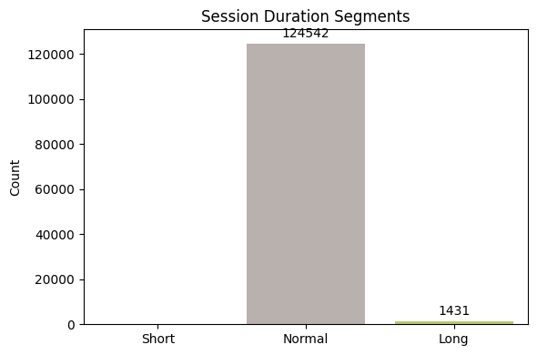

# NSL-KDD Cybersecurity Analysis Report

## About the Dataset

We used the **NSL-KDD dataset**, a well-known dataset in cybersecurity used to evaluate intrusion detection systems. Each row in the dataset represents a network session with various features like duration, bytes transferred, protocol used, and more.

Every session is labeled with an **attack type** (e.g., 'neptune', 'smurf') or 'normal'. We grouped all these attack types into **five categories** for clarity:

- **Normal** – Regular, legitimate sessions
- **DoS** – Denial of Service attacks
- **Probe** – Scanning attacks (e.g., port scanning)
- **R2L** – Remote-to-Local attacks
- **U2R** – User-to-Root attacks

---

## Step 1–4: Data Exploration and Cleaning

We examined the dataset, removed irrelevant features, and normalized the numeric values to bring them to the same scale.

We then reduced the number of features (columns) using a technique called PCA. This helped us keep only the most important information, making the analysis faster and clearer.

---

## Step 5: Abnormality Detection

### Single-Feature

To detect suspicious or abnormal network behavior, we analyzed **individual features** in the dataset. This means we looked at each column of data separately to find sessions that are unusual or "out of the ordinary."

Here are two important types of abnormal sessions we found:

#### Long-Lived, High-Volume Sessions

These are sessions that:

- Last much longer than the average connection time.
- Transfer a very large amount of data (sometimes tens of megabytes or more).

Why is this suspicious?

- Regular users usually don’t stay connected for this long or send this much data.
- These could be signs of:
  - A hacker scanning many ports for weaknesses.
  - Someone secretly sending large amounts of data out of the system (data theft).
  - Attacks trying to overload the system (like flooding the network).

**So we flagged these sessions as potential threats.**

---

#### Very Short but Active Sessions

These are sessions that:

- Lasted for just a very short time (a few milliseconds or seconds).
- Still had some activity (not completely empty).

Why is this suspicious?

- These may be attackers checking if a service or system is online.
- They often open and immediately close the connection, leaving behind traces that are shorter than normal.
- This behavior matches **reconnaissance** actions—when attackers are "scouting" before launching a real attack.

**These may also be signs of early-stage attacks.**

---

*(This is the visualization from the notebook section where we plotted session duration outliers.)*

---

### Multi-Feature

Instead of looking at just one column at a time, we now analyzed **multiple features together** to detect unusual behavior. This is useful because some attacks don’t stand out when we check just a single number (like duration or bytes), but they become clear when we look at a combination of different values.

We used a method called **Local Outlier Factor (LOF)**, which helps find sessions that behave very differently from the rest of the data based on several features combined (like duration, source bytes, destination bytes, etc.).

This method successfully identified about **1% of the data** as potential outliers (anomalies), which may include unknown or new types of attacks. These sessions didn’t follow the normal patterns and might deserve further investigation.

We noticed some normal sessions were incorrectly flagged, but this is expected in unsupervised detection.

---

## Step 6: Clustering

Clustering helps us group similar sessions together to find hidden patterns. We tried two different clustering approaches.

### A. Clustering by Attack Category (5 groups)

We attempted to group sessions into the 5 categories: Normal, DoS, Probe, R2L, and U2R using **K-Means** (an unsupervised method). However, it didn’t work well due to data imbalance — some categories had very few samples.

**Issue**: Rare attacks (like U2R) were missed or misclassified.

---

### B. Clustering into Attack vs Normal (2 groups)

Instead of 5 categories, we grouped sessions into just two clusters:

- Normal
- Attack (all other types combined)

This worked much better. The clustering method successfully identified:

- **85% of normal sessions**
- **98.6% of attacks**

This approach provided much clearer results and is suitable for detecting whether a session is an attack or not.

---

## Step 7: Segment Analysis

We sliced our sessions four different ways to uncover simple patterns.

---

### 7.1 Normal vs Attack  

- **Normal sessions:** 67 343  
- **Attack sessions:** 58 630  
- **What this tells us:** Nearly half of all sessions are flagged as attacks. This top-level split shows how much normal traffic we have to distinguish from malicious activity.  
and we can see that **Attack** sessions move a lot **more data** on average

---

### 7.2 Attack Category Distribution  

| Category | Count  |
| -------- | -----: |
| Normal   | 67 343 |
| DoS      | 45 927 |
| Probe    | 11 656 |
| R2L      |    995 |
| U2R      |     52 |

- **What this tells us:**  
  - **DoS** is the most common attack type (many small floods).  
  - **Probe** (port scans) comes next.  
  - **R2L/U2R** are rare, so they require special attention in detection.

---

### 7.3 Session Duration Segments  

| Segment | Count   |
| ------- | ------: |
| Short   |       0 |
| Normal  | 124 542 |
| Long    |   1 431 |

- **What this tells us:**  
  - Almost all sessions are “normal” length.  
  - A small number of **Long** sessions last hours, which often means bulk transfers or backdoor channels.

---

### 7.4 Total-Bytes Segments  

| Segment | Count   |
| ------- | ------: |
| Zero    | 49 112 |
| Low     |  8 167 |
| Medium  | 61 007 |
| High    |  7 687 |

- **What this tells us:**  
  - **Zero-byte** sessions (≈ 49 K) are likely failed handshakes or metadata probes.  
  - **Low-volume** sessions (≈ 8 k) are likley a small activity like a "Hello" text messege.  
  - **Medium-volume** sessions (≈ 61 K) are typical user activity (web/email).  
  - **High-volume** sessions (≈ 7.7 K) point to large downloads/uploads or data exfiltration.

---

> **Note:** The NSL-KDD data does **not** include timestamps, so we are unable to analyze any time-of-day or sequential patterns in these segments.

---

---

## Summary

- The dataset is rich and realistic, with known cyberattacks grouped into five types.
- We identified abnormalities using LOF and visualized them.
- Clustering directly into attack vs normal gives better results than clustering by specific attack types.
- These findings help us understand patterns in network traffic and prepare for building a detection model later in the pipeline.
